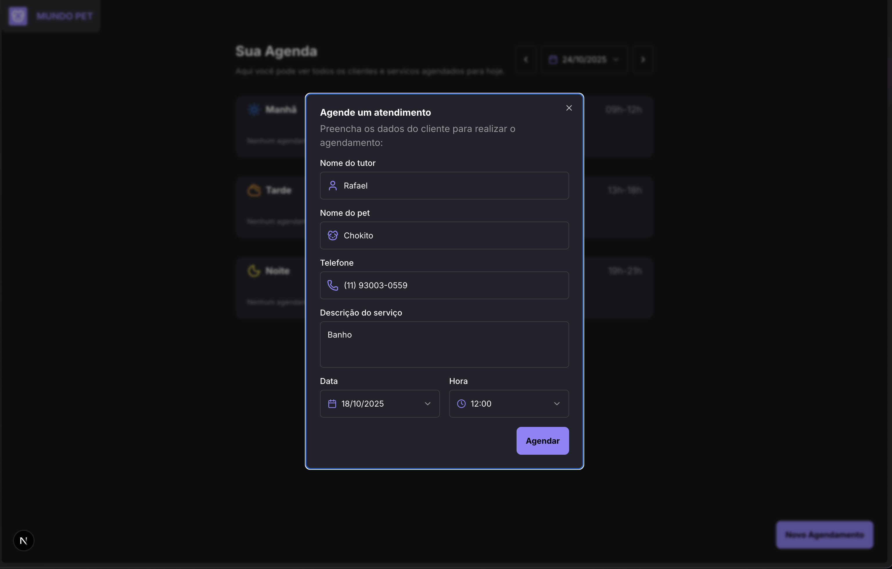
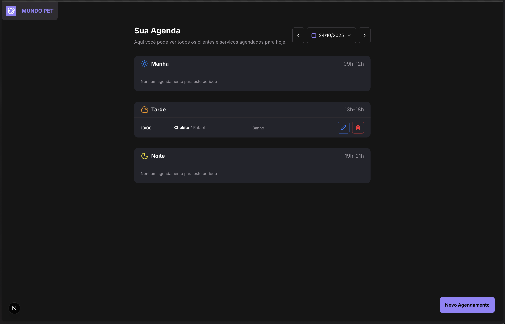

# 🐾 Pet Shop - Sistema de Agendamentos

Sistema de agendamento para pet shop desenvolvido com Next.js 15, React 19 e PostgreSQL.



## 📋 Funcionalidades

- ✅ Criar novos agendamentos
- ✅ Visualizar agendamentos por data
- ✅ Editar agendamentos existentes
- ✅ Excluir agendamentos
- ✅ Interface responsiva
- ✅ Validação de formulários
- ✅ Feedback visual com toasts



## 🚀 Tecnologias

- **Next.js 15** - Framework React com App Router
- **React 19** - Biblioteca para interfaces
- **TypeScript** - Tipagem estática
- **Tailwind CSS** - Estilização
- **Prisma** - ORM para banco de dados
- **PostgreSQL** - Banco de dados
- **Radix UI** - Componentes acessíveis
- **React Hook Form** - Gerenciamento de formulários
- **Zod** - Validação de schemas
- **Sonner** - Notificações toast

## 📦 Instalação

1. Clone o repositório:

```bash
git clone <url-do-repositorio>
cd pet-shop
```

2. Instale as dependências:

```bash
npm install
```

3. Configure as variáveis de ambiente:

```bash
cp .env.example .env
```

4. Inicie o banco de dados:

```bash
docker-compose up -d
```

5. Gere o cliente Prisma:

```bash
npx prisma generate
```

6. Execute as migrações:

```bash
npx prisma migrate dev
```

7. Inicie o servidor de desenvolvimento:

```bash
npm run dev
```

## 🗄️ Banco de Dados

O projeto utiliza PostgreSQL com Prisma ORM. O schema principal:

```prisma
model Appointment {
  id          String   @id @default(cuid())
  tutorName   String
  petName     String
  phone       String
  description String
  scheduleAt  DateTime
}
```

## 🎨 Componentes

- **AppointmentCard** - Card individual de agendamento
- **AppointmentForm** - Formulário de criação/edição
- **DatePicker** - Seletor de data
- **PeriodSection** - Seção de período (manhã/tarde/noite)
- **Header** - Cabeçalho da aplicação

## 📱 Layout Responsivo

O sistema é totalmente responsivo, adaptando-se a diferentes tamanhos de tela:

- Desktop: Grid com 4 colunas
- Mobile: Grid com 2 colunas

## 🔧 Scripts Disponíveis

```bash
npm run dev          # Servidor de desenvolvimento
npm run build        # Build de produção
npm run start        # Servidor de produção
npm run lint         # Verificação de código
npm run format       # Formatação de código
```

## 📄 Licença

Este projeto está sob a licença MIT.
